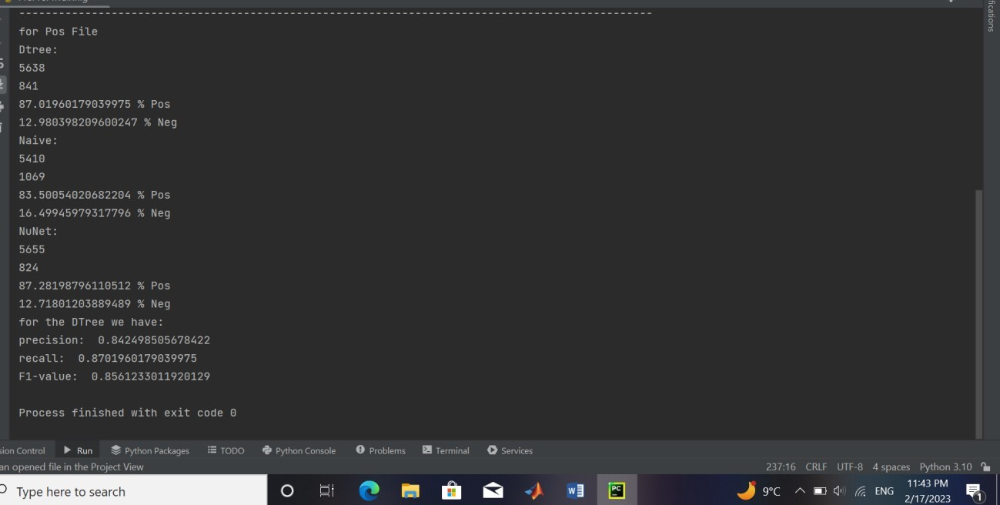
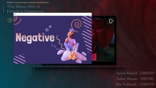
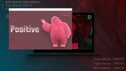

# AI Project - Tweet Emotion Detection

## Team Members:
- Saleh Khatib - 1200991
- Diaa Tahboub - 120013
- Taher Hasan - 1191740

## Instructor:
Dr. Aziz Qaroush

### Date: 2023/2/17

---

## Formalization

In this project, we focus on determining the emotional tone of tweets, whether they are positive or negative. This involves dealing with textual data, so we utilized Natural Language Processing (NLP) techniques to perform the following sequence of steps:

1. Divide tweets into sentences and words using tokenization functions.
2. Find the lemma of each word based on its meaning and context.
3. Identify the most frequent words and expressions using frequency distribution.

### Features Extracted

#### 1. Emoji
   - This feature analyzes emojis within sentences to determine the dominant emotional sentiment (positive, negative, or neutral). 
   - If positive sentiment prevails, the answer is 1; if negative sentiment prevails, the answer is -1; if they are equal, the answer is 0.

#### 2. Greetings and Prayers
   - This feature checks if tweets contain expressions of greeting and supplication.
   - If expressions are present, the answer is 1; otherwise, it's 0.

#### 3. Positive & Good
   - This feature checks if tweets contain words denoting positivity and goodness.
   - If such words are present, the answer is 1; otherwise, it's 0.

#### 4. Swear & Angry
   - This feature checks if tweets contain expressions of swearing and anger.
   - If such expressions are present, the answer is 1; otherwise, it's 0.

#### 5. Negative & Bad
   - This feature checks if tweets contain words denoting negativity and badness.
   - If such words are present, the answer is 1; otherwise, it's 0.

From these features, we can convert tweets into samples in the dataset.

## Classification

We apply three classifiers to our dataset:
- Decision Tree
- Naive Bayes
- Neural Network

Figure 5: Output Of Training & Testing1

Figure 6: Output Of Training & Testing2

We hope you enjoy our report.

Best wishes.

