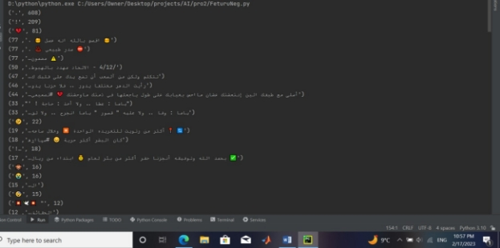
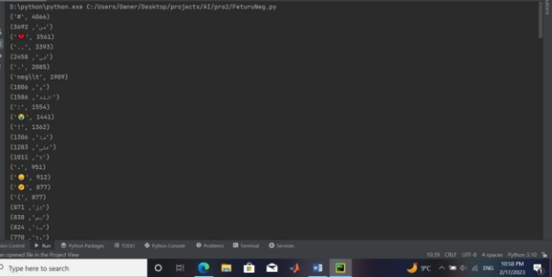
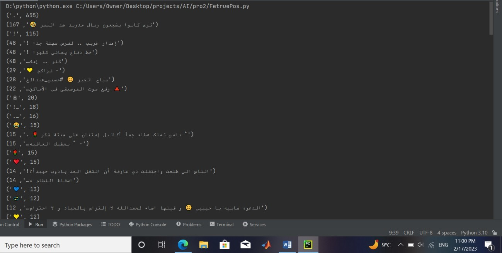
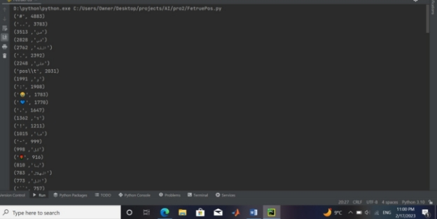



# **Ai project.**
**Tweet Emotion Detection Prepared by:**

**Saleh Khatib-1200991**
**Diaa Tahboub-120013**
**Taher Hasan-1191740**
**Dr. Aziz Qaroush**
**Date:2023/2/17**

**Formalization:**

In this project, we are talking about determining the type of Tweet, whether the Tweet is positive or negative, so we are talking about dealing with texts, so we resorted to using NLP (Natural Language Processing), where we did this sequence of steps:

1- Divide tweets into sentences and words by tokenize functions. 2- Finding the lemma of a word depending on its meaning and

context.

3- Find the most frequent words and expressions by frequency distribution.

Fig 1: Negative File Sentence Tokenize

Fig 2: Negative File Word Tokenize

Fig 3: Positive File Sentence Tokenize

Fig 4: Positive File Word Tokenize

From the previous steps, we deduce the following features:
1. ## **Emoji:**
This feature takes the emoji inside the sentences and determines the weight of the positive and the negative in them. If the positive weight is dominant over the negative, we take the answer as 1, and vice versa we take -1, but if they are equal, we take 0.
1. ## **Greetings and prayers:**
In this feature, we check the tweets if they contain expressions of greeting and supplication. If it contains expressions, the answer is 1, and if it does not, the answer is 0.
1. ## **Positive&Good:**
In this feature, we check the tweets if they contain words denoting positivity and goodness. If it contains the words, the answer is 1, and if it does not, the answer is 0.

1. ## **Swear&Angry:**
In this feature, we check the tweets if they contain expressions of swearing and anger. If it contains the words, the answer is 1, and if it does not, the answer is 0.
1. ## **Negative&Bad:**
In this feature, we check the tweets if they contain words denoting badness and negative. If it contains the words, the answer is 1, and if it does not, the answer is 0.

From these features we can convert tweets to samples in the Data Set.

After that we apply our 3 classifiers which are: Decision tree, Naive bayes, Neural network.

Fig 5: Output Of Training & Testing1.

Fig 6: Output Of Training & Testing1.

I hope you enjoy Our report.

Best wishes.

